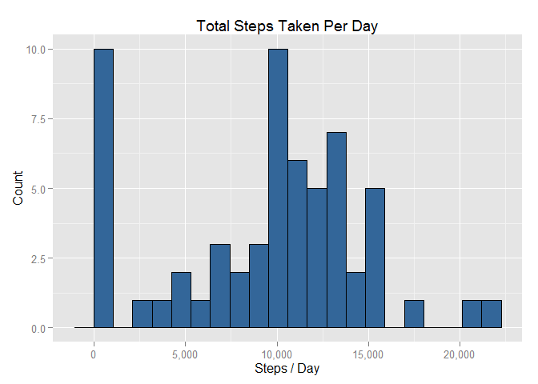
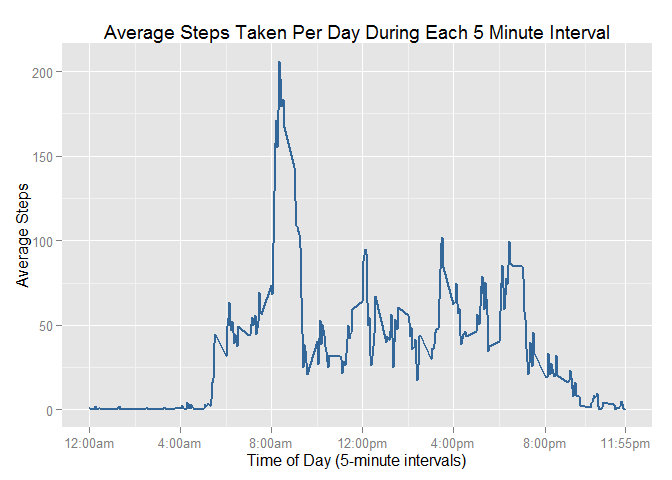
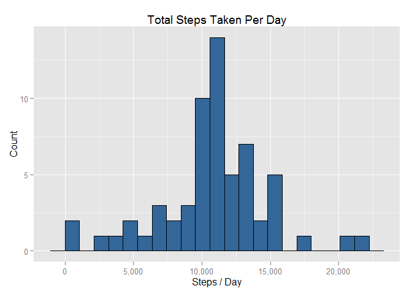
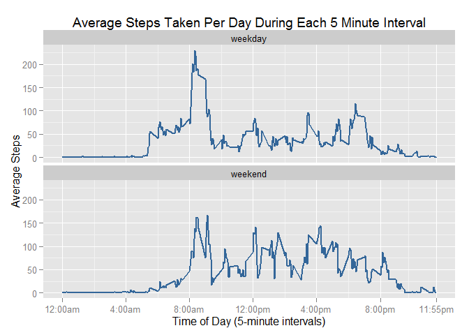

# Reproducible Research: Peer Assessment 1
Mike Kirby  
Sunday, October 18, 2015  


```r
# Load the required packages
suppressMessages({library(plyr);library(dplyr);library(lubridate);library(stats);library(ggplot2);library(scales)})
```

## Loading and preprocessing the data
### 1. Load the data


```r
# Read in the data for the analysis
setwd('~/DataScienceSpecialization-Coursera/5-ReproducibleResearch/PeerAssessment1/data/')
actDat <- read.csv('activity.csv')
```

### 2. Process/transform the data (if necessary) into a format suitable for your analysis


```r
# Clean up the data
actDat$date <- as.Date(ymd(as.character(actDat$date)))
```

## What is mean total number of steps taken per day?
For this part of the assignment, you can ignore the missing values in the dataset.

### 1. Calculate the total number of steps taken per day

```r
sumDat <- ddply(actDat, c("date"), summarize, steps_per_day=sum(steps, na.rm = TRUE))
sumDat
```

```
##          date steps_per_day
## 1  2012-10-01             0
## 2  2012-10-02           126
## 3  2012-10-03         11352
## 4  2012-10-04         12116
## 5  2012-10-05         13294
## 6  2012-10-06         15420
## 7  2012-10-07         11015
## 8  2012-10-08             0
## 9  2012-10-09         12811
## 10 2012-10-10          9900
## 11 2012-10-11         10304
## 12 2012-10-12         17382
## 13 2012-10-13         12426
## 14 2012-10-14         15098
## 15 2012-10-15         10139
## 16 2012-10-16         15084
## 17 2012-10-17         13452
## 18 2012-10-18         10056
## 19 2012-10-19         11829
## 20 2012-10-20         10395
## 21 2012-10-21          8821
## 22 2012-10-22         13460
## 23 2012-10-23          8918
## 24 2012-10-24          8355
## 25 2012-10-25          2492
## 26 2012-10-26          6778
## 27 2012-10-27         10119
## 28 2012-10-28         11458
## 29 2012-10-29          5018
## 30 2012-10-30          9819
## 31 2012-10-31         15414
## 32 2012-11-01             0
## 33 2012-11-02         10600
## 34 2012-11-03         10571
## 35 2012-11-04             0
## 36 2012-11-05         10439
## 37 2012-11-06          8334
## 38 2012-11-07         12883
## 39 2012-11-08          3219
## 40 2012-11-09             0
## 41 2012-11-10             0
## 42 2012-11-11         12608
## 43 2012-11-12         10765
## 44 2012-11-13          7336
## 45 2012-11-14             0
## 46 2012-11-15            41
## 47 2012-11-16          5441
## 48 2012-11-17         14339
## 49 2012-11-18         15110
## 50 2012-11-19          8841
## 51 2012-11-20          4472
## 52 2012-11-21         12787
## 53 2012-11-22         20427
## 54 2012-11-23         21194
## 55 2012-11-24         14478
## 56 2012-11-25         11834
## 57 2012-11-26         11162
## 58 2012-11-27         13646
## 59 2012-11-28         10183
## 60 2012-11-29          7047
## 61 2012-11-30             0
```

### 2. Make a histogram of the total number of steps taken each day

```r
binsize <- diff(range(sumDat$steps_per_day))/20
ggplot(sumDat, aes(x=steps_per_day)) +
    geom_histogram(binwidth=binsize, fill="#336699", 
                   colour="black") +
    scale_x_continuous(labels=comma) +
    xlab("Steps / Day") +
    ylab("Count") +
    ggtitle("Total Steps Taken Per Day")
```

 

### 3. Calculate and report the mean and median of the total number of steps taken per day

```r
paste0("Mean = ", comma(mean(sumDat$steps_per_day)))
```

```
## [1] "Mean = 9,354.23"
```

```r
paste0("Median = ", comma(median(sumDat$steps_per_day)))
```

```
## [1] "Median = 10,395"
```

## What is the average daily activity pattern?

### 1. Make a time series plot (i.e. type = "l") of the 5-minute interval (x-axis) and the average number of steps taken, averaged across all days (y-axis)

```r
tsDat <- ddply(actDat, c("interval"), summarize, 
               avg_steps=mean(steps, na.rm=TRUE))
ggplot(tsDat, aes(x=interval, y=avg_steps)) +
    geom_line(size=1.05, colour="#336699") +
    scale_x_continuous(breaks=c(seq(0, 2355, by=400), 2355), 
                       labels=c("12:00am", "4:00am", "8:00am", 
                                "12:00pm", "4:00pm","8:00pm",
                                "11:55pm")) +
    xlab("Time of Day (5-minute intervals)") +
    ylab("Average Steps") +
    ggtitle("Average Steps Taken Per Day During Each 5 Minute Interval")
```

 

### 2. Which 5-minute interval, on average across all the days in the dataset, contains the maximum number of steps?


```r
tsDat[grep(max(tsDat$avg_steps), tsDat$avg_steps, fixed=T), ]
```

```
##     interval avg_steps
## 104      835  206.1698
```

As indicated by the time series plot, as well as the calculation of the maximum above, the 5-minute interval that contains the maximum number of steps is 835 (or about 8:35am).

## Imputing missing values
Note that there are a number of days/intervals where there are missing values (coded as NA). The presence of missing days may introduce bias into some calculations or summaries of the data.

### 1. Calculate and report the total number of missing values in the dataset (i.e. the total number of rows with NAs)

```r
paste0("There are ", comma(sum(is.na(actDat$steps))), " missing values in the dataset")
```

```
## [1] "There are 2,304 missing values in the dataset"
```

### 2. Devise a strategy for filling in all of the missing values in the dataset. 
My strategy for filling in all of the missing values involves taking the mean for each 5-minute interval and inserting that mean into any missing values in the 'steps' column that correspond to the 5-minute interval for which the mean was calculated across all days.

### 3. Create a new dataset that is equal to the original dataset but with the missing data filled in.
Using the strategy outlined above, I created a new dataset that is equal to the original, but with the missing data filled in. It is called 'impDat'. 

```r
impDat <- merge(actDat, tsDat)
impDat <- dplyr::arrange(impDat, date, interval)
impDat <- impDat[c("date", "interval", "steps", "avg_steps")]
impDat[grep(TRUE, is.na(impDat$steps)), ]$steps <- impDat[grep(TRUE, is.na(impDat$steps)), ]$avg_steps
head(cbind(impDat[, 1:3], actDat[c("date", "interval", "steps")]), 10)
```

```
##          date interval     steps       date interval steps
## 1  2012-10-01        0 1.7169811 2012-10-01        0    NA
## 2  2012-10-01        5 0.3396226 2012-10-01        5    NA
## 3  2012-10-01       10 0.1320755 2012-10-01       10    NA
## 4  2012-10-01       15 0.1509434 2012-10-01       15    NA
## 5  2012-10-01       20 0.0754717 2012-10-01       20    NA
## 6  2012-10-01       25 2.0943396 2012-10-01       25    NA
## 7  2012-10-01       30 0.5283019 2012-10-01       30    NA
## 8  2012-10-01       35 0.8679245 2012-10-01       35    NA
## 9  2012-10-01       40 0.0000000 2012-10-01       40    NA
## 10 2012-10-01       45 1.4716981 2012-10-01       45    NA
```

### 4. Make a histogram of the total number of steps taken each day.  

```r
# Calculate the total number of steps taken per day
```

```r
sumDat2 <- ddply(impDat, c("date"), summarize, steps_per_day=sum(steps))

# Make a histogram of the total steps taken each day
binsize <- diff(range(sumDat2$steps_per_day))/20
ggplot(sumDat2, aes(x=steps_per_day)) +
    geom_histogram(binwidth=binsize, fill="#336699", 
                   colour="black") +
    scale_x_continuous(labels=comma) +
    xlab("Steps / Day") +
    ylab("Count") +
    ggtitle("Total Steps Taken Per Day")
```

 

#### Calculate and report the mean and median total number of steps taken per day.


```r
paste0("Mean = ", comma(mean(sumDat2$steps_per_day)))
```

```
## [1] "Mean = 10,766.19"
```

```r
paste0("Median = ", comma(median(sumDat2$steps_per_day)))
```

```
## [1] "Median = 10,766.19"
```

#### Do these values differ from the estimates from the first part of the assignment? 

The new estimate of the mean is greater than the previous estimate of the mean by 1,411.959 (i.e. 10,766.19 - 9,354.23).

The new estimate of the median is greater than the previous estimate of the median by 371.1887 (i.e. 10,766.19 - 10,395).

#### What is the impact of imputing missing data on the estimates of the total daily number of steps?
When missing values are left in the dataset as is, the number of days where the total number of steps is less than 500 is 10, as shown in the original histogram. When we impute missing data, the number of days where the estimated total number of steps is less than 500 is only 2, as shown in the second histogram. Further, the estimated mean, median, and mode of the total number of daily steps all increase when we impute missing data. In general, the estimates of the total daily number of steps increases when we impute missing data because we are replacing values being treated as zeros with values that are all greater than zero. 

## Are there differences in activity patterns betwen weekdays and weekends?
Use the dataset with the filled-in missing values for this part.
### 1. Create a new factor variable in the dataset with two levels - "weekday" and "weekend" indicating whether a given date is a weekday or weekend day.

```r
impDat$weekday <- mutate(impDat, weekday=wday(date, label=TRUE, abbr=TRUE))$weekday
impDat$weekday <- as.character(impDat$weekday)
impDat$weekend <- rep("weekday", times=nrow(impDat))
impDat[grep("Sat|Sun", impDat$weekday), ]$weekend <- "weekend"
impDat$weekend <- as.factor(impDat$weekend)
str(impDat)
```

```
## 'data.frame':	17568 obs. of  6 variables:
##  $ date     : Date, format: "2012-10-01" "2012-10-01" ...
##  $ interval : int  0 5 10 15 20 25 30 35 40 45 ...
##  $ steps    : num  1.717 0.3396 0.1321 0.1509 0.0755 ...
##  $ avg_steps: num  1.717 0.3396 0.1321 0.1509 0.0755 ...
##  $ weekday  : chr  "Mon" "Mon" "Mon" "Mon" ...
##  $ weekend  : Factor w/ 2 levels "weekday","weekend": 1 1 1 1 1 1 1 1 1 1 ...
```

### 2. Make a panel plot containing a time series plot (i.e. type = "l") of the 5-minute interval (x-axis) and the average number of steps taken, averaged across all weekday days or weekend days (y-axis). 

```r
tsDat2 <- ddply(impDat, c("interval", "weekend"), summarize, 
               avg_steps=mean(steps))
ggplot(tsDat2, aes(x=interval, y=avg_steps)) +
    geom_line(size=1.05, colour="#336699") +
    facet_wrap( ~ weekend, nrow=2) +
    scale_x_continuous(breaks=c(seq(0, 2355, by=400), 2355), 
                       labels=c("12:00am", "4:00am", "8:00am", 
                                "12:00pm", "4:00pm","8:00pm",
                                "11:55pm")) +
    xlab("Time of Day (5-minute intervals)") +
    ylab("Average Steps") +
    ggtitle("Average Steps Taken Per Day During Each 5 Minute Interval")
```

 

